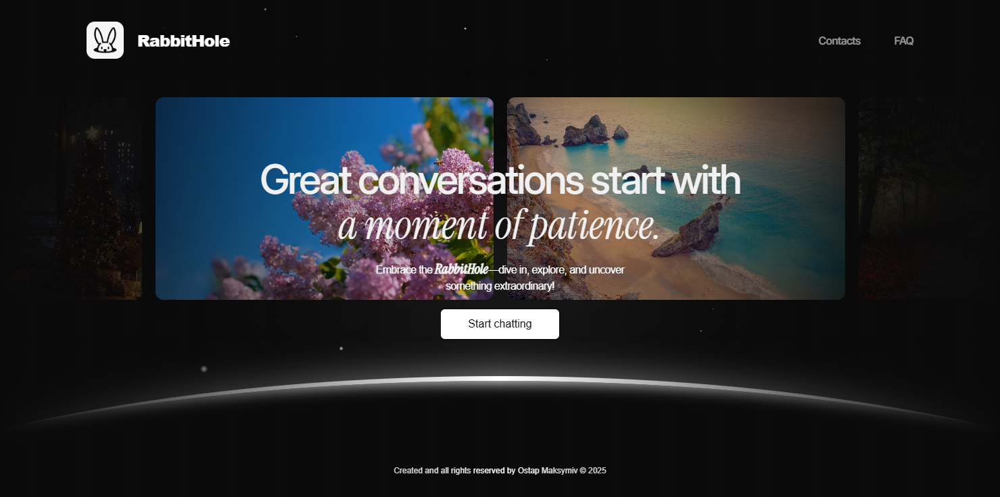

# Project Name

A communication application that allows users to exchange messages with each other and interact with AI. It supports user registration, login, messaging, and AI interactions that analyze conversations and provide suggestions.



## Description

This project was built using **Node.js** and **MongoDB**. The application allows users to exchange messages both between themselves and with AI. It integrates the **Gemini** model (for basic chats) and **Hume AI** (for emotion analysis and generating responses).

## Technologies

- **Node.js** – Backend
- **Express.js** – Framework for building the API
- **MongoDB** – Database
- **Mongoose** – Library for interacting with MongoDB
- **JWT** – For authentication and authorization
- **Tailwind CSS** – Styling framework (with custom styles added later)
- **Gemini** and **Hume AI** – AI models for analyzing and generating responses

## Installation

To install the project locally:

1. Clone or download the project from GitHub:
   - Frontend: [Link to Frontend Repo](https://github.com/OstapMaksymiv/Messenger-RabbitHole/tree/main/frontend)
   - Backend: [Link to Backend Repo](https://github.com/OstapMaksymiv/Messenger-RabbitHole/tree/main/backend)
   
2. Extract the ZIP file and navigate to both the **Frontend** and **Backend** directories.

3. Install the required dependencies:
   - **Frontend**:
     ```bash
     cd frontend
     npm install
     npm run dev
     ```
   - **Backend**:
     ```bash
     cd backend
     npm install
     npm run server
     ```

4. Ensure you have a running **MongoDB** database.

5. The project should be accessible locally at: `http://localhost:3400`

## Database Structure

1. **User Model** – Stores user information (full name, username, password, gender, profile picture).
2. **Message Model** – Represents messages exchanged between users and AI (includes text, images, and read/unread status).
3. **Conversation Model** – Stores conversations between users (includes participants and messages).
4. **AI Conversation Model** – Represents AI interactions (history of conversations with the user, labeled as "user" or "model").

## Token Issue

The project was developed in a rush, so it is not perfect in terms of appearance and responsiveness. One reason for this is that I initially started with **Tailwind CSS**, but towards the end of the project, I realized I wanted a better-looking design, so I added custom styles which conflicted with the Tailwind styles.

Additionally, there is an issue with the **token** – everything works fine on the computer, but on smartphones (Safari and Chrome), there are problems, and the token either is not visible or is simply not created. After reading some discussions on Reddit, I found that this might be related to one of the updates of **Render**, **Safari**, or **Chrome**, so for now, it's left as is. Despite this, the functionality works reasonably well.

## API Endpoints

- **POST /api/auth/login** – User login
- **POST /api/auth/signup** – User registration
- **POST /api/auth/logout** – User logout
- **GET /api/messages** – Get messages
- **POST /api/messages/send/:id** – Send a message to a user
- **GET /api/conversation** – Get user conversation history
- **GET /api/users** – Get a list of users
- **POST /api/ai-chats** – Interact with AI

## Future Enhancements

- Integration with more advanced AI models.
- Expansion of group chat functionality.
- Optimization for mobile device responsiveness.
